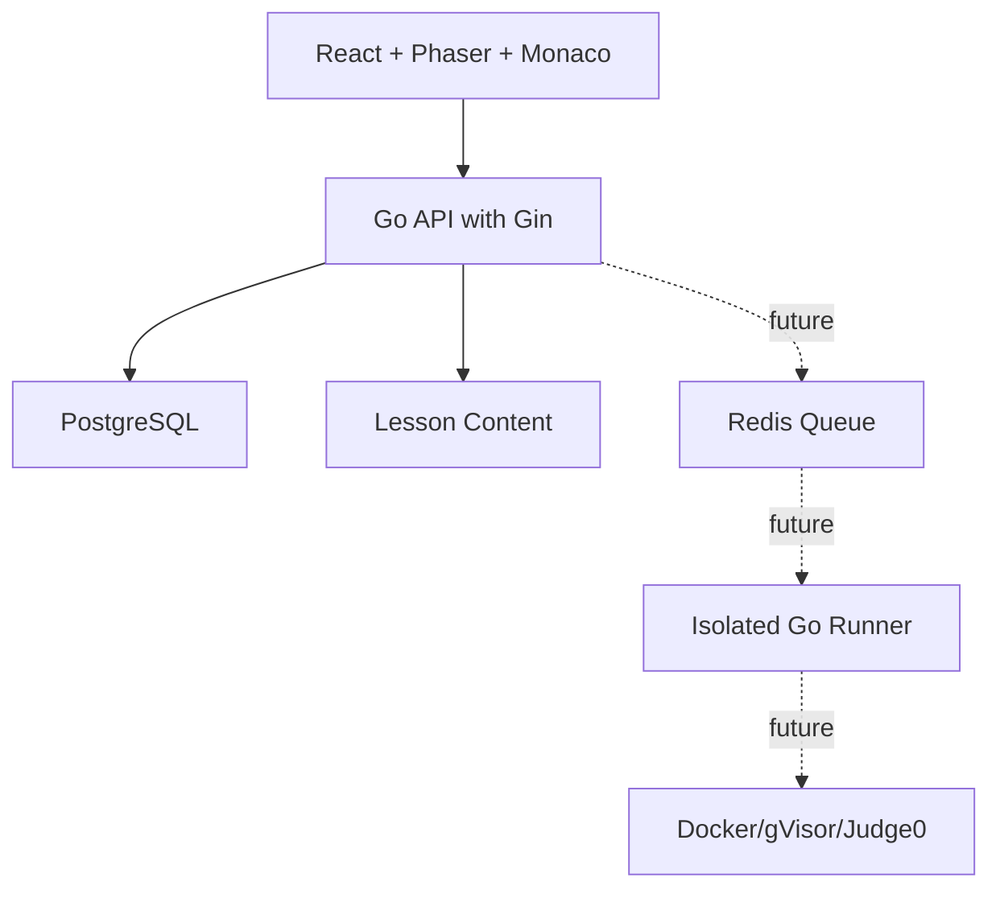
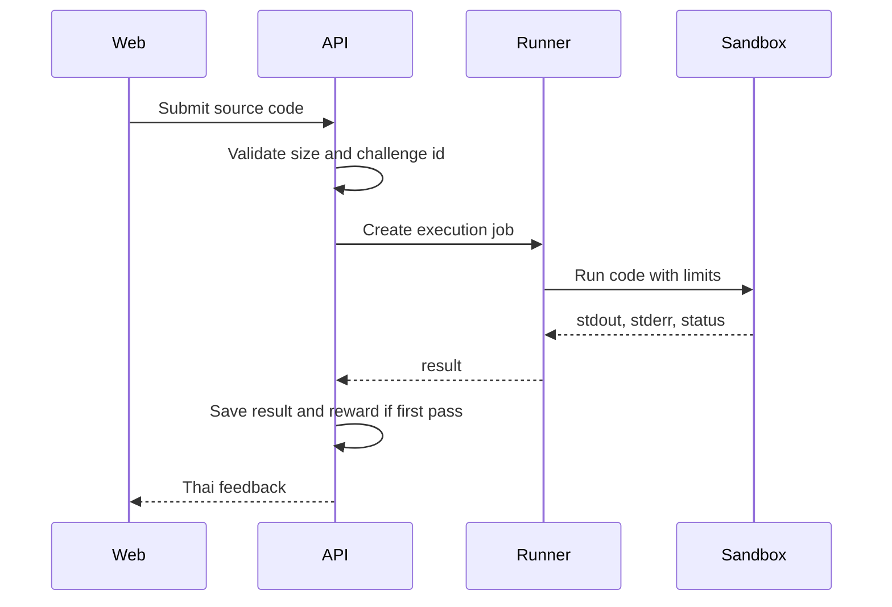

# Architecture Rules

## Architecture Goal

Keep the system simple enough to build quickly, but structured enough to grow into a real learning platform.

The first architecture should support:

- Web-based 2D game.
- Lesson content outside source code.
- Go backend API.
- PostgreSQL persistence.
- Future isolated code runner.

## High-Level Architecture



## Preferred Repository Structure

```text
.
├── .ai/
├── apps/
│   ├── web/
│   └── api/
├── content/
│   ├── lessons/
│   └── quests/
├── infrastructure/
│   ├── docker/
│   └── migrations/
├── docker-compose.yml
├── README.md
└── .gitignore
```

## Frontend Responsibilities

The frontend owns:

- Game display.
- Player input.
- UI state.
- Lesson reading experience.
- Code editor.
- Calling API.
- Showing feedback.

The frontend must not own:

- Hidden test cases.
- EXP calculation.
- Trust decisions.
- Secure code execution.
- Final validation of completion.

## Backend Responsibilities

The backend owns:

- Health endpoint.
- Lesson and quest API.
- Player progress.
- Submission metadata.
- Reward calculation.
- Hidden test orchestration.
- Auth later.

The backend API process must not directly run untrusted user code.

## Code Runner Boundary

Untrusted code execution is a separate concern.



Rules:

- No `os/exec` for user code inside API handlers.
- Runner must have timeout.
- Runner must limit source size and output size.
- Network should be disabled inside execution environment.
- Hidden tests must be composed server-side.

## Frontend Module Boundaries

Suggested modules:

```text
apps/web/src/
├── app/
├── game/
│   ├── scenes/
│   ├── entities/
│   └── config/
├── features/
│   ├── quests/
│   ├── lessons/
│   ├── editor/
│   └── progress/
├── shared/
│   ├── api/
│   ├── storage/
│   ├── ui/
│   └── types/
└── main.tsx
```

## Backend Module Boundaries

Suggested modules:

```text
apps/api/
├── cmd/api/
├── internal/
│   ├── config/
│   ├── http/
│   ├── lessons/
│   ├── quests/
│   ├── progress/
│   ├── submissions/
│   └── platform/
├── migrations/
├── go.mod
└── go.sum
```

## API Guidelines

Use versioned routes:

```text
GET  /health
GET  /api/v1/lessons
GET  /api/v1/lessons/:id
GET  /api/v1/progress/:playerId
PUT  /api/v1/progress/:playerId
POST /api/v1/submissions
GET  /api/v1/submissions/:id
```

Standard error response:

```json
{
  "error": {
    "code": "invalid_request",
    "message": "ข้อมูลที่ส่งมาไม่ถูกต้อง",
    "details": {}
  }
}
```

## Data Ownership

| Data | Source of Truth |
|---|---|
| Lesson content | Content files initially, backend later |
| Quest completion | Backend when available |
| EXP | Backend |
| Draft code | Frontend localStorage |
| Hidden tests | Backend/runner only |
| Public examples | Content/API |

## Environment Variables

Do not hard-code service URLs.

Examples:

```text
VITE_API_BASE_URL=http://localhost:8080
API_PORT=8080
DATABASE_URL=postgres://...
CORS_ALLOWED_ORIGIN=http://localhost:5173
```

## Architecture Smells

Avoid:

- Massive React components that mix Phaser, API, and lesson rendering.
- Lesson text hard-coded in UI components.
- Backend services that return hidden tests.
- Runner sharing source code directory with API.
- Premature microservices before one playable lesson exists.
- Generic abstractions before two or three concrete use cases exist.

