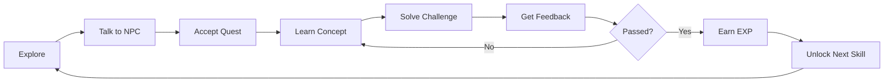
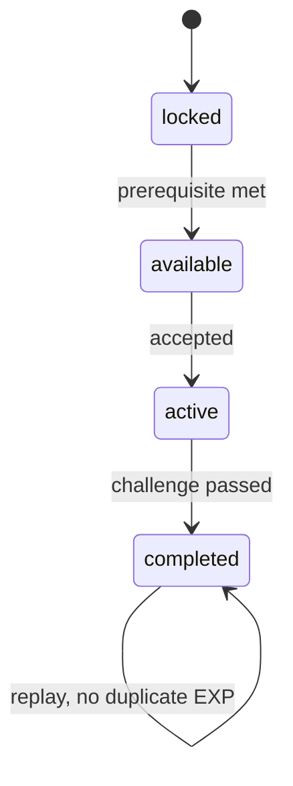

# Game Design Rules

## Game Identity

Go Quest is a 2D RPG learning game. The player should feel like they are exploring a world, helping characters, solving problems, and growing as a backend developer.

## Core Loop



## First World: Beginner Village

Purpose:

- Teach project basics and Go entry point.
- Make the player comfortable with controls.
- Introduce Professor Gopher.

First quest:

```text
คำทักทายจาก Gopher
```

Concepts:

- `package main`
- `import`
- `func main`
- `fmt.Println`

## NPC Design

Each NPC should have:

- Name
- Role
- Personality
- Quest relationship
- Dialogue lines
- Interaction prompt
- State after quest completion

Example:

| Field | Value |
|---|---|
| Name | Professor Gopher |
| Role | Mentor |
| Purpose | Introduce Go basics |
| Tone | Kind, clear, slightly playful |
| First Prompt | กด E เพื่อพูดคุย |

## Quest States

Allowed states:

```text
locked
available
active
completed
```

Rules:

- `locked`: prerequisite not met.
- `available`: player can accept.
- `active`: accepted but not completed.
- `completed`: passed and reward granted.

State transitions:



## Reward Rules

Initial reward model:

| Action | Reward |
|---|---|
| Complete first lesson | 100 EXP |
| Use hint level 1 | No penalty |
| Use hint level 2 | -10 EXP |
| Use hint level 3 | -20 EXP |
| Replay completed lesson | 0 additional EXP |

Backend should calculate final reward when available.

## Skill Tree

Initial skill path:

1. Hello World
2. Variables
3. Conditions
4. Loops
5. Functions
6. Slices
7. Maps
8. Structs
9. Interfaces
10. Error Handling
11. Goroutines
12. Channels
13. REST API
14. PostgreSQL
15. Testing
16. Production Readiness

## Boss Fights

Boss fights are larger challenges that combine concepts.

Examples:

- Function Boss: write reusable calculation logic.
- Slice Boss: filter and transform inventory items.
- API Boss: build endpoint with validation.
- Concurrency Boss: process tasks with workers.
- Database Boss: fix slow query.
- Final Boss: build auth plus CRUD plus Docker deployment.

## Hint Design

Hints should escalate gradually:

1. Concept hint.
2. Direction hint.
3. Structural hint.
4. Explanation after failure.

Do not reveal the full answer immediately.

Example:

```text
Hint 1: ลองคิดว่าเราต้องการให้โปรแกรมแสดงข้อความออกมาทางหน้าจอ
Hint 2: ใน Go เราใช้ fmt.Println เพื่อพิมพ์ข้อความ
Hint 3: ข้อความต้องอยู่ในเครื่องหมาย "..."
```

## Progression Feeling

The player should receive a small reward frequently:

- Dialogue changes.
- Quest status updates.
- EXP animation.
- Skill unlock.
- Achievement.
- NPC acknowledgement.

Avoid long stretches of reading without interaction.

## Achievement Ideas

- First Gopher Greeting
- First Compile Error Fixed
- First Function
- Zero Panic
- Slice Explorer
- Interface Negotiator
- Goroutine Starter
- API Apprentice
- SQL Problem Solver
- Production Ready

