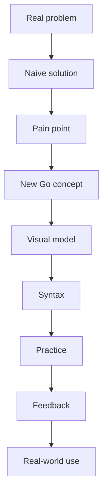

# Go Learning Rules

## Teaching Goal

Teach Go for real backend work. The player should understand both syntax and reason.

Every Go concept should answer:

- What problem does this solve?
- What happens if we do not use it?
- How does Go express it?
- How is it used in real work?
- What mistake do beginners often make?

## Learning Progression

Recommended path:

1. Program entry point.
2. Variables and types.
3. Conditions.
4. Loops.
5. Functions.
6. Arrays and slices.
7. Maps.
8. Structs.
9. Methods.
10. Interfaces.
11. Errors.
12. Packages and modules.
13. Testing.
14. Goroutines.
15. Channels.
16. Context.
17. HTTP.
18. JSON.
19. PostgreSQL.
20. Docker.
21. Clean architecture.
22. Production readiness.

## Concept Teaching Pattern

Use this sequence:



## Beginner Tone

Do:

- Explain slowly.
- Use analogies.
- Show one new idea at a time.
- Give immediate practice.

Do not:

- Introduce advanced idioms too early.
- Use production jargon before the player has context.
- Turn every explanation into documentation.

## Go Idiom Rules

When teaching Go:

- Prefer explicit error handling.
- Keep code simple and readable.
- Use standard library before frameworks when teaching fundamentals.
- Introduce frameworks only when solving realistic app problems.
- Explain why Go avoids inheritance-heavy design.
- Teach interfaces through behavior, not abstract theory first.

## Error Handling Teaching

Teach errors as normal program flow, not scary exceptions.

Good framing:

```text
ใน Go เราถามฟังก์ชันตรง ๆ ว่า "งานสำเร็จไหม ถ้าไม่สำเร็จเกิดอะไรขึ้น"
```

## Concurrency Teaching

Concurrency must be visual.

Teach in this order:

1. One worker is slow.
2. Multiple workers can help.
3. Goroutines start lightweight tasks.
4. Channels pass messages.
5. Shared data can race.
6. Mutex protects shared data.
7. Context cancels work.

## Backend Teaching

Backend lessons should be realistic:

- HTTP request and response.
- JSON encoding and decoding.
- Validation.
- Status codes.
- Database queries.
- Transactions.
- Tests.
- Logs.
- Timeouts.
- Deployment.

## Enterprise Mode

Enterprise mode should simulate real developer tasks:

- Read user story.
- Interpret acceptance criteria.
- Fix bug report.
- Read logs.
- Write tests.
- Review a pull request.
- Resolve merge conflict.
- Optimize a query.
- Investigate incident.
- Roll back safely.

## Assessment Rules

- Use tests for correctness.
- Use public examples for understanding.
- Keep hidden tests server-side.
- Do not grade only by stdout for complex tasks.
- Provide Thai feedback tied to the failed concept.

