# Product Context

## Product Name

Go Quest

Possible subtitles:

- Go Quest: Gopher Academy
- Go Quest: Backend RPG
- Go Quest: From Beginner to Production

## Vision

Create the most approachable Thai-first RPG for learning Go and backend engineering, where players progress from zero knowledge to practical production readiness.

## Mission

Help Thai learners understand Go by turning abstract programming concepts into visual, interactive, story-driven challenges.

## Target Users

| Segment | Description | Need |
|---|---|---|
| Beginner | คนที่เริ่มเขียนโปรแกรมหรือเริ่ม Go | ต้องการคำอธิบายง่าย เห็นภาพ และไม่เบื่อ |
| Junior Developer | เขียนโค้ดได้บ้าง แต่อยากใช้ Go ทำงานจริง | ต้องการ practice, project, feedback |
| Backend Developer | เคยใช้ภาษาอื่นและอยากย้ายมา Go | ต้องการ mapping จาก concept เดิมสู่ Go idiom |
| Self Learner | ชอบเรียนผ่านเกมและ challenge | ต้องการ progression และ reward |

## Primary Outcomes

Players should eventually be able to:

- Write basic Go programs.
- Understand Go project structure.
- Use functions, structs, interfaces, slices, maps, errors, and tests.
- Build REST APIs.
- Connect PostgreSQL.
- Use Docker for local development.
- Debug common backend issues.
- Understand concurrency with goroutines and channels.
- Read logs and reason about production incidents.

## Product Shape

Go Quest combines:

- RPG world
- Quest system
- NPC dialogue
- Thai explanations
- Visual simulations
- Coding challenges
- Hidden tests
- EXP and skill tree
- Project missions
- Enterprise mode

## World Structure

```mermaid
flowchart LR
    A["Beginner Village"] --> B["Variable Forest"]
    B --> C["Function Mountain"]
    C --> D["Struct City"]
    D --> E["Interface Castle"]
    E --> F["Concurrency Lab"]
    F --> G["API Kingdom"]
    G --> H["Database Dungeon"]
    H --> I["Clean Architecture Empire"]
    I --> J["Enterprise World"]
```

## MVP Scope

The MVP is one complete vertical slice:

- Beginner Village
- One controllable player
- Professor Gopher NPC
- One quest: "คำทักทายจาก Gopher"
- One Thai lesson: Hello World
- One coding challenge
- Mock or simple runner
- Local progress
- EXP reward

## Not MVP

These are intentionally delayed:

- Full account system
- AI Tutor
- AI Code Review
- Secure public code runner
- Payment
- Multiplayer
- Mobile-first editor
- Real-time leaderboard
- Kubernetes lessons

## Roadmap

### Milestone 0: Project Context

- Create `.ai/` context rules.
- Define product, architecture, content, and workflow.

### Milestone 1: Project Foundation

- Monorepo.
- React/Vite frontend.
- Go/Gin backend.
- Health check.
- Docker Compose.

### Milestone 2: First Game Scene

- Beginner Village.
- Player movement.
- Camera follow.
- Collision.

### Milestone 3: Quest And Dialogue

- Professor Gopher.
- Dialogue system.
- Quest state.
- Local persistence.

### Milestone 4: Lesson And Editor

- Content files.
- Thai lesson panel.
- Monaco editor.
- Mock runner.

### Milestone 5: Backend Persistence

- PostgreSQL.
- Player progress.
- Submissions.
- EXP.

### Milestone 6: Safer Code Runner

- Separate runner service.
- Timeout.
- Output limit.
- Hidden tests.

### Milestone 7: First Public Demo

- Complete first lesson.
- Smooth UX.
- Clear README.
- Deployment path.

## Success Metrics

Early qualitative metrics:

- A beginner can complete the first quest without external help.
- The player can explain `package main`, `func main`, and `fmt.Println` in Thai after playing.
- The game loop feels rewarding within 5 minutes.

Later quantitative metrics:

- First quest completion rate.
- Average retries before success.
- Hint usage per concept.
- Return rate for next lesson.
- Challenge pass rate.
- Time to complete each world.

