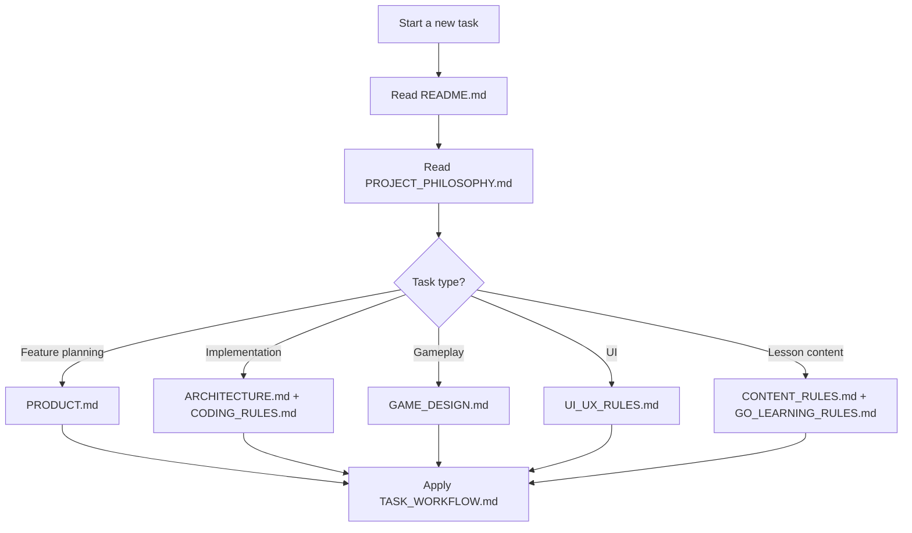

# Go Quest AI Context

เอกสารในโฟลเดอร์นี้คือ context หลักของโปรเจกต์ Go Quest สำหรับมนุษย์และ AI coding agent ทุกตัว ก่อนเริ่มงานใหม่ให้อ่านไฟล์นี้ก่อน แล้วเลือกอ่านไฟล์เฉพาะด้านตามงานที่กำลังทำ

## Project Summary

Go Quest คือเกม RPG สำหรับเรียนภาษา Go สำหรับคนไทย ตั้งแต่ระดับเริ่มต้นจนถึงระดับทำงานจริง เป้าหมายไม่ใช่แค่สอน syntax แต่ทำให้ผู้เล่นเข้าใจว่า Go ใช้แก้ปัญหาอะไรในงาน backend และ production

แนวคิดหลัก:

- เกมนี้ต้องเป็น RPG ที่สอน Go ไม่ใช่คอร์สออนไลน์ที่มีเกมตกแต่ง
- ทุกบทเรียนต้องเริ่มจากปัญหาที่ผู้เล่นเข้าใจได้
- ทุก concept สำคัญต้องมีภาพ, interaction, feedback, และ challenge
- ภาษาไทยต้องอ่านง่าย อธิบายศัพท์เทคนิคโดยไม่บิดความหมาย
- ผู้เล่นควรได้ลองผิด ลองใหม่ และเห็นผลทันที

## File Map

| File | Purpose | Read When |
|---|---|---|
| [PROJECT_PHILOSOPHY.md](./PROJECT_PHILOSOPHY.md) | เข็มทิศของโปรเจกต์ | ทุกงานที่มีผลต่อ product direction |
| [PRODUCT.md](./PRODUCT.md) | vision, users, scope, roadmap | วางแผน feature หรือ milestone |
| [ARCHITECTURE.md](./ARCHITECTURE.md) | technical architecture และ folder direction | สร้างหรือแก้โครงสร้างระบบ |
| [CODING_RULES.md](./CODING_RULES.md) | coding standards สำหรับ TS, React, Go | เขียนหรือแก้โค้ด |
| [GAME_DESIGN.md](./GAME_DESIGN.md) | rules ของ RPG, quest, EXP, progression | เพิ่ม gameplay, NPC, quest, reward |
| [UI_UX_RULES.md](./UI_UX_RULES.md) | layout, interaction, accessibility | สร้างหน้า UI หรือ game screen |
| [CONTENT_RULES.md](./CONTENT_RULES.md) | format และคุณภาพของ lesson content | เขียนบทเรียน, dialogue, hint |
| [GO_LEARNING_RULES.md](./GO_LEARNING_RULES.md) | วิธีสอน Go จาก beginner ถึง enterprise | ออกแบบ concept, challenge, explanation |
| [TASK_WORKFLOW.md](./TASK_WORKFLOW.md) | วิธีทำงานแบบ goal-driven | เริ่ม goal ใหม่หรือ review งาน |
| [PROMPT_GUIDE.md](./PROMPT_GUIDE.md) | prompt template ที่ใช้ซ้ำได้ | สั่งงาน AI รอบถัดไป |

## Recommended Reading Order

## Current Preferred Stack

| Area | Technology |
|---|---|
| Frontend | React, TypeScript, Vite |
| Game Engine | Phaser |
| Code Editor | Monaco Editor |
| Styling | Tailwind CSS |
| Backend | Go, Gin |
| Database | PostgreSQL |
| DB Access | pgx first, sqlc later if useful |
| Content | Markdown plus YAML or JSON |
| Local Dev | Docker Compose |
| Initial Code Runner | Mock runner or Go Playground style integration |
| Production Runner | Isolated runner, Judge0, or gVisor-based worker |
| AI Tutor | Not in MVP; predefined hints first |

## Non-Negotiables

- Do not run untrusted user code inside the main API process.
- Do not build the first version around AI Tutor, multiplayer, Redis, or microservices.
- Do not hard-code lesson content inside React components.
- Do not make UI that feels like a landing page when the task asks for the game.
- Do not reveal hidden test cases to the frontend.
- Do not reward repeated submissions with duplicate EXP.
- Do not translate technical terms so aggressively that the meaning becomes wrong.

## First Vertical Slice

The first playable milestone should be:

1. Player opens the game.
2. Player enters Beginner Village.
3. Player controls a character.
4. Player talks to Professor Gopher.
5. Player accepts the first quest.
6. Player reads a Thai explanation of `package main`, `func main`, and `fmt.Println`.
7. Player edits starter Go code.
8. Player runs or submits.
9. System gives feedback.
10. Player completes the quest and receives EXP.

## How To Update These Rules

When adding new rules:

- Put the rule in the file that owns that responsibility.
- Avoid copying the same paragraph into multiple files.
- Link between files when two areas touch.
- Keep rules actionable.
- Include examples when a rule can be misunderstood.

