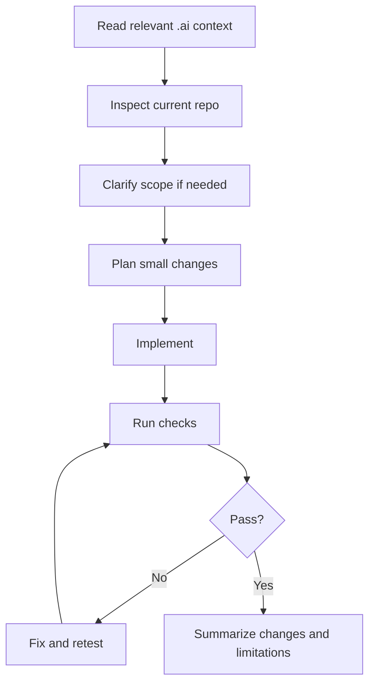

# Task Workflow

## Default Workflow

Use this workflow for every meaningful task:



## Before Editing

Check:

- Current files.
- Existing project conventions.
- Git status.
- Relevant `.ai/` rules.
- Whether the change belongs in code, content, docs, or infrastructure.

## Scope Control

When a task says to build one milestone:

- Do that milestone.
- Avoid adding future systems unless required.
- Leave clear TODO notes only when they clarify future direction.
- Do not silently expand into AI, auth, Redis, or production runner.

## Goal Mode Guidance

Good goals are:

- Specific.
- Testable.
- Small enough to finish.
- Based on a playable or verifiable outcome.

Bad goal:

```text
สร้างเกม Go Quest ทั้งหมด
```

Good goal:

```text
สร้าง Beginner Village ที่ผู้เล่นเดินได้ คุยกับ NPC ได้ และรับ Quest แรกได้
```

## Definition Of Done

For documentation tasks:

- Files exist.
- Responsibilities are clear.
- Links work.
- No major duplicated sections.
- Future agents know what to read.

For implementation tasks:

- Feature works locally.
- Tests pass.
- Build passes.
- Errors are handled.
- Docs are updated.
- Limitations are honest.

## Review Checklist

Before finishing:

- Did the work match the newest user request?
- Did it preserve the product philosophy?
- Did it avoid scope creep?
- Did it create duplicate rules?
- Did it introduce unsafe assumptions?
- Did it document what remains?

## Suggested Milestone Order

1. Project context.
2. Monorepo foundation.
3. Beginner Village scene.
4. NPC and quest state.
5. Thai lesson content.
6. Monaco challenge editor.
7. Backend progress API.
8. Safer runner.
9. Hidden tests.
10. First vertical slice polish.

